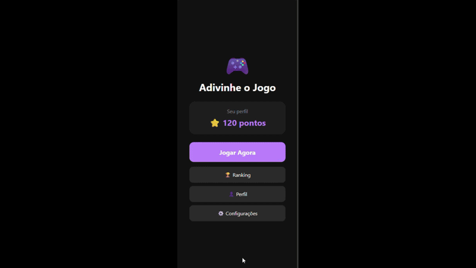

# 🎮 Adivinhe o Jogo- Desafio do Jogo

<div align="center">

[]()
[]()
[]()

Um jogo divertido e desafiador onde você precisa adivinhar o jogo apenas com a imagem gerada

</div>


## 📋 Visão Geral e Requisitos

### 🎯 Objetivo
Desenvolver um aplicativo mobile que apresenta uma imagem de jogo aleatório, onde o usuário deve adivinhar qual jogo é baseado em uma imagem.

### 📱 Requisitos do Projeto
- ✅ Sistema de pontuação conforme acerta os jogos
- ✅ Ranking de pontos dos jogadores  
- ✅ Perfil de nivel baseado no acumulo de pontos 
- ✅ feedback sonoro ao acertar corretamente o jogo


## 🛠 Tecnologias Utilizadas

### Plataforma & Framework
- **React Native** – Framework para desenvolvimento mobile  
- **Expo** – Plataforma para build e execução  
- **JavaScript/JSX** – Linguagem de programação

### Armazenamento & Backend
- **Firebase Realtime Database** – Banco de dados que armazena o usuario e os pontos
- **AsyncStorage** – Armazenamento local no dispositivo

### Bibliotecas Principais
- **Expo Haptics** – Feedback tátil  
- **Expo AV** – Reprodução de áudio  
- **React Navigation** – Navegação entre telas

### UI/UX
- **React Native Stylesheet** – Estilização  
- **TouchableOpacity** – Componentes interativos  
- **Custom Hooks** – Gerenciamento de estado  


## 🎮 Funcionalidades

### 🖼 Sistema de Jogo Principal
- **Adivinhação por imagem:** Um jogo diferente a cada tentativa para o usuario adivinhar  
- **Pontuação:** A cada acerto o usuario ganha pontos, e conforme mais pontos maior sera será seu rank 
- **Feedback imediato:** Ao acertar o jogo, será realizado som de comemoração assim como uma vibração

### 💡 Sistema de Progressão

- Pontos salvos no banco de dados
- Evolução do rank do jogador conforme a quantidade de pontos possuido

### 🏆 Sistema de Ranking

- Rank aualizado em tempo real conforme os pontos aumentam
- Rank ordenado pelo jogador com maior acumulo de pontos

### 🤵 Perfil do Usuario

- Nome
- Pontuação
- Nivel Atual

### 🆙 Sistema de nivel

- Conforme o usuario alcança um determinado numero de pontos, ele pode subir o nivel

| Pontos | Nivel |
|--------|------|
|0-19 |iniciante|
|20-59| aprendiz|
|60-119|intermediario|
|120-199|veterano|
|200-299|aspirante|
|300-499|profissional|
|500-699|mestre|
|700-999|mestre supremo|
|1000+|lendario|


### 🔊 Feedback Multissensorial
- Vibração tátil em acertos  
- Sons de feedback para acertos  


### 🎨 Interface do Usuário
- Tema escuro moderno  
- Navegação intuitiva  
- Botões com design consistente  


## 🎥 Demonstração

### 📸 GIF do Aplicativo



---

## 🎬 Fluxo do Usuário

1. **Home** → Vizualiza os pontos, assim como iniciar jogo
2. **Jogo** → Adivinha jogo aleatório pela imagem gerada
3. **Resultado** → Tela de parabéns e estatísticas  
4. **Ranking** → Exibe o ranking global dos jogadores com as pontuações
5. **Perfil** → Exibe o status pregressivo do usuario
6. **Configuração** → Possivel desligar o ligar o som do app quando acerta o jogo


## 🚀 Instalação e Execução

### 📲 Pré-requisitos
- App **Expo Go** instalado no celular (disponível na Play Store ou App Store)  
- Conta gratuita no **Expo** (opcional, mas recomendada para publicar o projeto)


### ⚡ Execução Rápida

1. **Baixe o projeto**
   - Faça o download do repositório como **.zip** pelo GitHub e extraia os arquivos,  
     **ou**
   - Clone o repositório diretamente:
     ```bash
     git clone [url-do-repositorio]
     ```

2. **Acesse o [Expo Snack](https://snack.expo.dev/)**
   - Abra o site do Expo Snack.  
   - Clique em **"Import GitHub"** ou **"Upload files"** e selecione a pasta do projeto.

3. **Execute o projeto**
   - Após o upload, clique em **"Run"** no canto superior direito.  
   - Escaneie o **QR Code** exibido usando o app **Expo Go** no celular.

4. **Pronto!**
   - O aplicativo abrirá automaticamente no seu dispositivo, sem precisar instalar nada localmente.

### 💡 Aprendizados e Próximos Passos

#### 🎓 Reflexão sobre o Desenvolvimento

Durante o desenvolvimento deste projeto, foi possível compreender de forma prática como diferentes aspectos do ecossistema mobile se conectam para criar uma experiência completa.  
A integração com o **Firebase Realtime Database** foi um dos pontos mais eficiente, pois foi possivel armazenar os usuario com suas pontuação

Além disso, trabalhar com **feedbacks táteis e sonoros** trouxe uma nova perspectiva sobre **UX em dispositivos móveis**, mostrando como pequenos detalhes podem melhorar significativamente a interação do usuário.  
Por fim, o uso de **React Native com Expo** demonstrou a praticidade da plataforma para criar e distribuir aplicativos de forma rápida, sem perder a qualidade da experiência final.

#### 🎯 Desafios Superados

- Sistema de usuario unico por dispositivo

- Organização de codigo em multiplas telas

- Sincronização de pontos com FireBase

- Feedback claro ao usuário

- Atualização em tempo real do Ranking

#### 🚀 Próximos Passos

- Modo desafio com limite diário

- Login social (Google, Apple)

- Sistema de conquistas

- Jogar contra outro jogador em tempo real e quem acertar primeiro recebe mais pontos

- Fazer "salas" para poder reunir diversos jogadores para poder fazer competições e/ou torneios 

- Otimização de performance

<div align="center">
